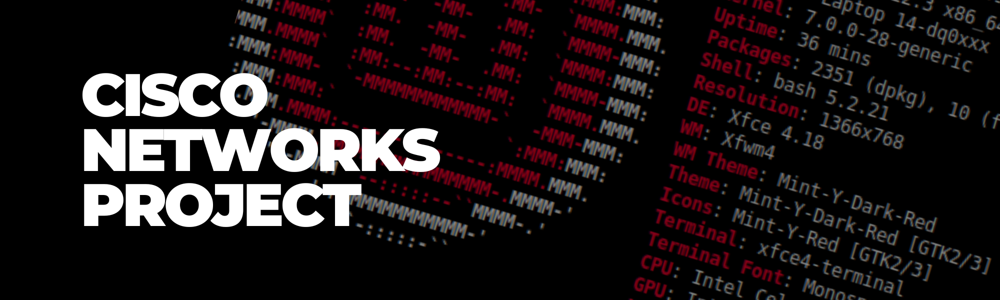
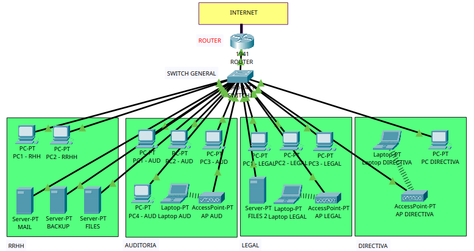

# 🌐 Segmentación de Red PYME con VLANs y Firewall

## por: Eleonor A.H. (@leonXxit0)

> **Sobre Mí:** Soy abogada con experiencia en **PYMEs, gestión de proyectos y relaciones públicas**. Mi trayectoria profesional se centra en la consultoría legal, negocios y el cumplimiento normativo de personas jurídicas. Lo que me diferencia es mi capacidad para tender puentes entre el **Derecho** y la **Tecnología**. He complementado mi formación legal con estudios técnicos en **redes IP y ciberseguridad**, lo que me permite comprender los riesgos tecnológicos y traducirlos al lenguaje legal que las empresas necesitan para protegerse.

---
## 📖 Descripción del Proyecto

Este proyecto consiste en el diseño e implementación de una red empresarial segmentada lógicamente utilizando **VLANs** y control de acceso mediante **Firewall (ACLs)** en el entorno de simulación **Cisco Packet Tracer**.

La red simula el entorno de una empresa con los departamentos de **RRHH**, **Auditoría**, **Legal** y **Dirección**, donde:

- ✅ Cada departamento se encuentra en su propia VLAN.
- ✅ El tráfico entre departamentos está **bloqueado** por defecto.
- ✅ Solo el departamento de **Dirección** tiene acceso irrestricto a todas las VLANs.
- ✅ Los servidores (MAIL, BACKUP, FILES) están en una VLAN separada y son accesibles desde todos los departamentos.

### 📌 Objetivo:

El objetivo principal es **aislar el tráfico** entre los departamentos para garantizar:

- 🔒 **Seguridad y confidencialidad** de los datos sensibles.
- 🛡️ **Aislamiento de fallos** y contención de posibles ataques.
- 👁️ **Control de acceso** centralizado, permitiendo solo a Dirección una vista global de la red.

### 💻 Captura de la Red

La topología física incluye:

- 1 Router (actúa como firewall mediante ACLs)
- 1 Switch General (distribuye VLANs y tráfico trunk)
- 10 PCs (distribuidas por departamento)
- 3 Servidores (MAIL, BACKUP, FILES)
- 3 Access Points (Wi-Fi para Auditoría, Legal y Dirección)
- 1 Laptop (conexión Wi-Fi en VLAN de Dirección)

*Figura 1: Vista lógica de la red corporativa segmentada. Cada departamento opera en su propia VLAN, aislada del resto. El router central aplica políticas de firewall (ACLs) para controlar el tráfico entre VLANs.*

---

### 📄 Documentación

📎 [Descargar Informe Ejecutivo en (.pdf)](./Informe-red.pdf)
*(Incluye análisis de riesgos, implicaciones legales y referencias normativas).*

📎 [Descargar Archivo de Simulación (.pkt)](./Proyecto-red.pkt)  
*(Para visualizar la configuración en Cisco Packet Tracer).*

---

## 📬 Contacto

📧 [elarhuaa@gmail.com](mailto:elarhuaa@gmail.com)
